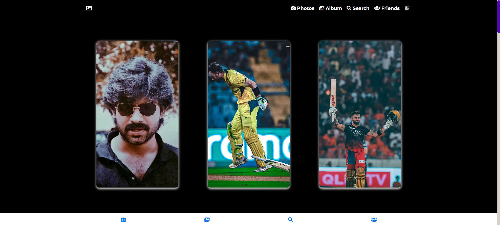

# Image-Gallery

This repository contains a responsive image gallery website built using Bootstrap 4 and jQuery. It features a modern interface where users can view various images in a grid layout, click on them to see a larger version in a modal window, and toggle between light and dark modes for different viewing preferences. The gallery is designed to be easy to use and customizable, making it suitable for showcasing collections of photos or artworks online.

## Features

- **Responsive Gallery**: Images are displayed in a grid layout, adjusting to different screen sizes for optimal viewing.
- **Modal Display**: Click on any image to view it in a modal window, providing a closer look without leaving the gallery page.
- **Dark Mode**: Enhance visibility and reduce eye strain by toggling between light and dark modes.
- **Full-Screen View**: Immerse yourself in the beauty of your images with full-screen mode within the modal display.
- **Hover Effects**: Enjoy a subtle zoom-in effect on images as you hover over them, adding interactivity to your browsing experience.
- **Side Navigation**: Easily navigate through different sections like Photos, Albums, and Trash using the sidebar.
- **Search and Upload** (feature not yet implemented): Look for specific photos or upload new images to enrich your gallery.

## Technologies Used

- HTML5: Structure your web content.
- CSS3: Style your web pages and make them visually appealing.
- JavaScript (ES6): Add interactivity and functionality to your gallery.
- Font Awesome: Access a wide range of icons for intuitive navigation.

## Installation

1. Clone the repository or download the source code files to your local machine.
2. Open the `index.html` file in a modern web browser of your choice.

Alternatively, you can host the project on a web server or use a local development server such as the Live Server extension for Visual Studio Code.

## Usage

1. Upon opening the `index.html` file, you'll be greeted with the Image Gallery interface.
2. Use the sidebar navigation to switch between different sections like Photos, Albums, and Trash.
3. Click on any image to open it in a modal view for a closer look.
4. Close the modal by clicking outside of it or on the close button.
5. Customize your viewing experience by toggling between light and dark modes using the sun/moon icon in the top-right corner.

## Customization

Tailor the gallery to your preferences by tweaking the following files:

- `index.html`: Adjust the HTML structure and content to suit your needs.
- `styles.css`: Modify the styles and colors to match your design aesthetic.
- `script.js`: Enhance existing functionality or add new features by editing the JavaScript code.

## Contributing

We welcome contributions from the community! If you encounter any issues or have suggestions for improvements, feel free to open an issue or submit a pull request.

## License

This project is licensed under the [MIT License](LICENSE), granting you the freedom to use and modify it according to your requirements.

## Acknowledgements

We extend our gratitude to the following:

- [Font Awesome](https://fontawesome.com/): Providing the icons that enhance the visual appeal and usability of the gallery.
- [Google Fonts](https://fonts.google.com/): Supplying the elegant Poppins font used throughout the project.
- [Unsplash](https://unsplash.com/) and other image sources: Offering stunning sample images to populate the gallery and inspire creativity.

Enjoy exploring and showcasing your images with the Image Gallery!
